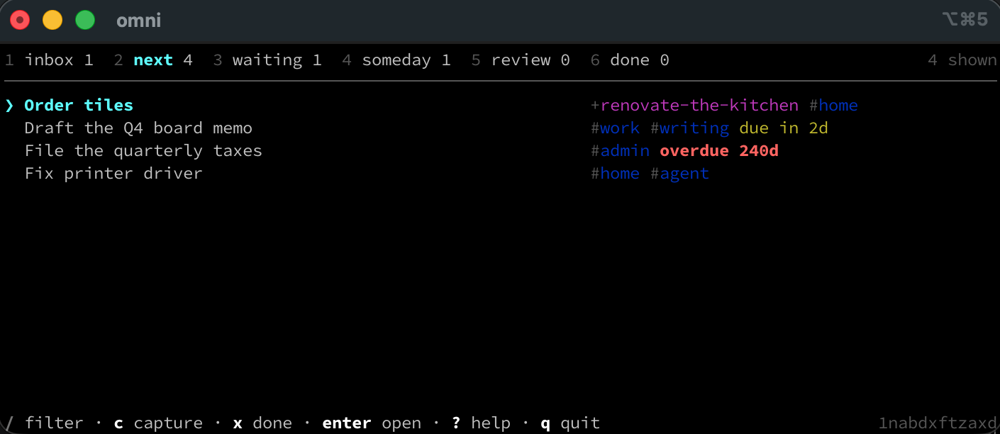

<picture>
  <source media="(prefers-color-scheme: dark)" srcset="assets/wordmark-dark.svg">
  
</picture>

A Getting Things Done task manager for the terminal. Every task is one small markdown
file in `~/.omnifactum`, so your task list is a folder you can read, edit, grep, back up
and keep long after you have stopped using this program.

It has a keyboard-driven interface for you, and a JSON command line for AI agents. Both
can be running at the same time on the same list without stepping on each other.



**Contents**

- [Install](#install) · [Your first five minutes](#your-first-five-minutes)
- [The six lists](#the-six-lists) · [The interface](#the-interface) · [The command line](#the-command-line)
- [Emptying the inbox](#emptying-the-inbox) · [Projects](#projects) · [The weekly review](#the-weekly-review)
- [Working with AI agents](#working-with-ai-agents) · [Your data](#your-data)
- [Questions](#questions) · [Development](#development)

## Install

You need [Bun](https://bun.sh).

```bash
brew install bun
bun install
bun link          # puts `omni` on your PATH
omni init         # creates ~/.omnifactum
```

Then run `omni` with no arguments to open the interface.

<details>
<summary><code>omni: command not found</code></summary>

`bun link` installs into `~/.bun/bin`, which is **not** added to your PATH if you
installed Bun through Homebrew — only Bun's own install script adds it. Add it once:

```bash
echo 'export PATH="$PATH:$HOME/.bun/bin"' >> ~/.zprofile
exec zsh -l
```

</details>

<details>
<summary>A standalone binary, with no Bun needed to run it</summary>

```bash
bun run build     # produces dist/omni
```

Copy `dist/omni` anywhere on your PATH.

</details>

## Your first five minutes

**Write something down.** Do not think about it yet — that is a separate job.

```bash
omni add "That thing Priya mentioned"
omni add "Fix printer driver" -t home --next
omni add "Order tiles" -t home --next
```

The first one lands in your **inbox**, which is for things you have captured but not yet
decided anything about. The other two went straight to **next**, the list of things you
could actually do right now.

**See what you could be doing.**

```bash
omni next
```

```
1nabc9c70  Order tiles         #home
1nabc9cq3  Fix printer driver  #home
```

**Decide what the inbox item really is.** Open the interface with `omni`, press `1` for
the inbox, then `C`:

```
clarifying   That thing Priya mentioned

Is there anything to do about this?

  y  yes, something has to happen
  n  no, nothing has to happen
```

It asks a short, fixed set of questions and files the item for you. That is
[the clarify walk](#emptying-the-inbox), and it is the habit that makes the rest work.

**Finish something.**

```bash
omni done fix-printer-driver --note "Vendor PPD 4.2 did it."
```

Completed tasks move to `done/2026-09/`, out of your way but not gone. The note goes into
the task's log, a permanent record of what happened to it.

That is the whole loop: capture without thinking, clarify deliberately, work from `next`,
and look over everything once a week.

## The six lists

A task's state is simply the folder it sits in. Nothing else records it, so moving a file
with `mv` genuinely changes its state.

| List | What belongs in it |
| --- | --- |
| `inbox` | Captured, not yet thought about. Empty this regularly. |
| `next` | Ready to act on now. If it is here, you can start it. |
| `waiting` | Delegated to someone, or blocked on something outside you. |
| `someday` | Not now. Reconsidered at your weekly review. |
| `review` | An agent finished it and you have not checked it yet. |
| `done` | Completed, filed by month. |

`review` is not part of GTD — it exists because an agent finishing a task does not get to
decide the task is finished. See [Working with AI agents](#working-with-ai-agents).

A task in `someday` can carry a `defer` date. When that date arrives, the next `omni`
command you run moves it to `next` for you. That is why `next` can be read literally: if
something is in there, it is actionable today.

## The interface

Run `omni` with no arguments. Press `?` for the full key list — it is generated from the
keymap itself, so it can never be out of date.

**Getting around**

| Key | Does |
| --- | --- |
| `j` `k` or arrows | move the cursor |
| `g` `G` | jump to the first or last row |
| `ctrl-d` `ctrl-u` | page down, page up |
| `1`–`6` | switch between inbox, next, waiting, someday, review, done |
| `p` | projects, with stalled ones called out |
| `enter` | open the task in full, including its log |
| `esc` | back out of a task, a walk, or the filter |
| `q` | quit |

**Doing things to a task**

| Key | Does |
| --- | --- |
| `c` | capture into the inbox, from anywhere |
| `C` | clarify it, question by question |
| `x` | complete it, asking what you did |
| `N` | note what happened, changing nothing else |
| `t` | edit its tags |
| `m` | move it to another list |
| `e` | open it in `$EDITOR` |
| `X` | delete it permanently, after confirming |

Delete is a capital `X`, sitting next to nothing common, because there is no undo.

**Narrowing and reviewing**

| Key | Does |
| --- | --- |
| `/` | filter, using the [same query language](#finding-things) as the command line |
| `.` | also show deferred tasks |
| `W` | walk the weekly review |
| `r` | reread everything from disk |

When you capture with `c`, anything you type as `#tag` or `+project` is pulled out of the
line and applied, so `Order tiles #home +renovate-the-kitchen` does what it looks like.

### It notices changes made elsewhere

The data folder is watched. If an agent in another terminal finishes something, it leaves
your list without a restart and a line tells you why:

```
"Fix printer driver" was completed by agent:claude-code: Installed vendor PPD 4.2.
```

The cursor stays where you left it rather than jumping to the top. A task you have open in
full stays on screen and simply shows its new state, so you are never quietly switched to
a different task. One that gets deleted underneath you drops back to the list and says so.

Watching is a convenience, not a safety mechanism — every write re-checks the file it is
about to touch regardless. Press `r` to reread at any time, or set `OMNI_NO_WATCH=1` to
turn watching off.

## The command line

Everything the interface does is available as a command, and every command takes `--json`.

| Command | Does |
| --- | --- |
| `omni add "Title"` | capture a task |
| `omni list [query]` | tasks matching a query; defaults to `next` |
| `omni inbox` / `next` / `waiting` / `someday` / `review` | one list |
| `omni due` | everything with a deadline, soonest first |
| `omni show <task>` | one task's file, including its log |
| `omni done <task>` | complete it |
| `omni mv <task> <list>` | move it |
| `omni note <task> "..."` | add a line to its log, changing nothing else |
| `omni tag <task> +add -remove` | change its tags |
| `omni tags` | every tag in use, with counts |
| `omni rm <task> --yes` | delete it permanently |
| `omni edit <task>` | open it in `$EDITOR` |
| `omni path [task]` | the data folder, or one task's file |
| `omni project …` | [projects](#projects) |
| `omni weekly` | [the weekly review](#the-weekly-review) |
| `omni submit <task> --note "..."` | hand finished work back for review |
| `omni doctor` | check the data; `--fix` repairs what is safe |
| `omni agents` | print the contract agents read |

`omni help` lists them all. A few aliases are not in that list but work anyway: `ls`,
`a`, `new`, `complete`, `move`, `delete`, `remove`, `cat`, `check`, `projects` and `p`.

**Referring to a task** means its id, any unambiguous prefix of that id, or its filename
stem — not its title. `omni rm buy-milk` works; `omni rm "Buy milk"` does not.

**Useful flags on `add`**: `-t tag`, `-p project`, `--due 2026-09-14`, `-n "a first
note"`, and `--next` / `--waiting` / `--someday` to skip the inbox. Add `-w "Sam"`
alongside `--waiting` to record who you asked, and `--defer 2026-10-01` alongside
`--someday` to park something until that date.

### Finding things

The same query language works on the command line and in the interface's `/` filter.

```bash
omni next home                 # tagged home
omni next calls home           # both tags
omni next home,work            # either tag
omni next --not home           # not tagged home
omni next /printer             # text in the title or body
omni list is:overdue           # everything past its deadline
omni list due:+7d              # due within a week
omni list project:renovate-the-kitchen
omni list state:waiting waiting_on:sam
omni list state:inbox no:tags  # captured and never tagged
```

Spaces mean **and**, commas mean **or**, and a leading `-` or `!` means **not**. There are
no parentheses, on purpose: one level of and-of-ors covers what people actually type at a
prompt.

One wrinkle: your shell reads a bare `-home` as a flag, so on the command line exclude a
tag with `--not home`, or quote it as `'!home'`. `-t` and `--any` exist for the same
reason. In the interface's `/` filter bar there is no shell in the way, and `-home` works
exactly as written.

| Field | Values |
| --- | --- |
| `state:` | `inbox` `next` `waiting` `someday` `review` `done` |
| `project:` | a project's filename stem |
| `waiting_on:` | who you are waiting on (substring match) |
| `due:` | `today` `tomorrow` `+7d` `-2w` `+1m` `2026-09-14`, optionally prefixed `<=` `>=` `=` |
| `is:` | `overdue` `deferred` `done` `tagged` `untagged` |
| `has:` / `no:` | `project` `due` `defer` `tags` `waiting_on` `body` `log` |

## Emptying the inbox

Capturing is easy and reviewing is a habit. Clarifying — deciding what a captured thing
actually *is* — is the step that decides whether either was worth doing, and it is the one
people skip.

Press `C` on an inbox item and answer the questions:

```
clarifying   That thing Priya mentioned        2 more after this

Is there anything to do about this?

  y  yes, something has to happen
  n  no, nothing has to happen
```

Say **yes** and it asks whether this is one action or part of a project, whether you are
doing it or someone else is, and what context it belongs to. Say **no** and it offers
someday/maybe or an outright delete — and nothing else, because there is no reference
folder here and no trash.

Filing one item opens the next, so `C` is a pass over the whole inbox rather than a dialog
you keep reopening. `b` goes back a question, `esc` leaves the current item untouched, and
anything already filed stays filed. Pressed outside the inbox, it clarifies that one task
and stops.

Every answer is written into the task's log, so next month you can still see what you
decided and why.

## Projects

A project is any outcome that takes more than one action. It gets its own file with an
`outcome` field: a sentence saying what "done" will look like.

```bash
omni project new "Renovate the kitchen" --outcome "Cooking in the new kitchen"
omni add "Order tiles" -p renovate-the-kitchen --next
omni project list
```

```
renovate-the-kitchen  Renovate the kitchen  (1 live)
```

A project with nothing in `next` or `waiting` to move it forward is **stalled**, and both
`omni project list` and the weekly review call that out. It is the most common way a
project quietly dies, and the outcome statement is what makes it noticeable — without one
there is no way to tell a finished project from an abandoned one.

| Subcommand | Does |
| --- | --- |
| `omni project list` | every project, with `STALLED` and counts |
| `omni project new "Title" --outcome "..."` | start one |
| `omni project show <project>` | the file, plus its actions |
| `omni project outcome <project> "..."` | change what done looks like |
| `omni project rename <project> "New title"` | rename it *and* repoint its tasks |
| `omni project done <project>` | finish it |
| `omni project mv <project> <active\|someday\|done>` | park it or revive it |

Use `omni project rename` rather than renaming the file: tasks point at their project by
its filename, so renaming one by hand orphans them, while `rename` repoints every member
in a single pass. `omni project done` refuses while actions are still open, unless you
pass `--yes`.

Press `p` in the interface for the same list.

## The weekly review

The habit that stops the whole system quietly rotting. It walks every list and asks a
different question of each.

```bash
omni weekly              # what each list wants you to look at
omni weekly --record     # log the pass and stamp the projects
```

```
1. Empty the inbox  (1)
   For each: is it actionable? If so, what is the very next physical action?
   · 1 item still to be thought about

2. Check finished work  (0)   — clear
   Read what was done. Accept it, or send it back with a reason.

3. Review your next actions  (4)
   Is each of these still the right next step, and still worth doing?
   · "File the quarterly taxes" is past its due date
```

It flags things worth acting on rather than just counting them: an overdue action, a
delegation nobody has chased in a week, a project with no next action or no outcome, a
task pointing at a project that no longer exists. A step with nothing to do says `clear`
so you can move straight past it.

Press `W` in the interface to walk it step by step, with the relevant list shown
underneath. **Every ordinary key works inside the walk** — complete, tag, move, open — so
finding a problem and fixing it does not cost you your place. `n` advances, `b` goes back,
and going past the last step records the pass.

Recording appends a line to `REVIEW.md` and stamps every active project with the date,
which is what makes "what have I not looked at in a month" answerable later.

## Working with AI agents

`omni` has no AI features of its own. It is the filing cabinet; an agent is just another
actor that can open the drawer.

**Point an agent at the guide:**

```
Read ~/.omnifactum/AGENTS.md and work the tasks tagged `agent`.
```

`omni init` writes that file, and `omni agents` prints it, so an agent can be handed one
command instead of a path. It covers how to find work, how to report what was done, how to
refer to a task, the exit codes, and what not to touch.

For Claude Code specifically there is a ready-made skill in this repo at
`skills/omni-work/`, which walks the whole loop — find, read, do, submit — and
knows the things that otherwise cost an agent a few wasted minutes. Copy it to
`~/.claude/skills/` to have it available from any project:

```bash
cp -r skills/omni-work ~/.claude/skills/
```

Then `/omni-work`, or just ask for the task queue to be worked.

**Mark work as fair game** by tagging it `agent`. Agents are told to take work only from
`next` — never from `inbox` (not thought about yet), `someday` (deliberately not now),
`waiting` (someone else owns it) or `review` (already finished).

```bash
omni next --tag agent --json
```

**Agents do not mark tasks done.** They submit:

```bash
omni submit 1nab5 --note "Installed vendor PPD 4.2." --actor "agent:claude-code" --json
```

That moves the task to `review` — a queue you drain, the way `inbox` is a queue for things
you have not thought about yet. `omni done` is refused outright for an `agent:` actor,
with `--force` as an explicit override.

**You decide:**

```bash
omni review                                   # what is waiting for you
omni done fix-printer --note "Checked, fine." # accept it
omni mv fix-printer next --note "Still jams." # send it back, with a reason
```

`--note` is required when submitting, because a submission with nothing to read gives you
nothing to review. Sending work back carries a note too, so the agent finds out what was
wrong rather than guessing. In the interface, moving anything out of `review` asks for the
reason first, whether you are accepting it or rejecting it.

For progress that is not a state change, `omni note <task> "..."` adds a line to the log
and leaves everything else alone.

### The JSON contract

Every command takes `--json`. Successes and failures both arrive as JSON on **stdout**,
with stderr empty, so one parse covers every outcome:

```console
$ omni show nope --json
{
  "ok": false,
  "error": "no task matches \"nope\"",
  "code": 3
}
```

| Exit code | Means |
| --- | --- |
| 0 | it worked |
| 1 | it failed |
| 2 | the command was wrong |
| 3 | no such task, or the reference was ambiguous |
| 4 | someone else was writing; wait a moment and retry |

Set `--actor`, or export `OMNI_ACTOR=agent:name` once, so the log records who did what.

### You and agents at the same time

This is safe, and it is the reason agents are asked to write through the CLI rather than
straight to the files.

Every `omni` write takes a short exclusive lock and **re-reads the task inside it**, so a
change applies to whatever the task has become rather than to a copy read a moment
earlier. Two agents adding a tag both get their tag. An agent completing a task you are
looking at does not undo the tag you just added. Completing something already finished
fails cleanly instead of happening twice. Tests spawn a dozen real processes against one
list and assert that nothing is lost.

Two practical consequences:

**Give a command your change, not a finished result.** `omni tag 1nab5 +reviewed` adds to
whatever tags exist at that moment. Reading a task, editing the tag list yourself, and
writing the whole thing back would discard anything added in between.

**A lock only binds writers that take it.** Editing in vim, or moving a file with `mv`,
bypasses it — and that is fine. Every write also re-checks a file's timestamp and size and
refuses to clobber a change it did not expect, so hand edits are tolerated; the strong
guarantee is for writers going through `omni`.

## Your data

Everything lives in `~/.omnifactum` (override with `OMNI_DIR` or `--dir`).

```
~/.omnifactum/
  AGENTS.md               the contract, for agents and for you
  REVIEW.md               a line per recorded weekly review
  inbox/                  captured, not yet thought about
  next/                   ready to act on now
  waiting/                delegated or blocked
  someday/                not now
  review/                 an agent finished it; you have not checked it
  done/2026-09/           completed, bucketed by month
  projects/active/
  projects/someday/
  projects/done/2026-08/
```

A task file is short and meant to be read:

```markdown
---
id: 0tq7f2k9abcd
title: Fix printer driver
created: 2026-09-12T10:04:00Z
tags: [home, errand, agent]
---

Driver crashes after the OS update. Try the vendor PPD first.

## Log

- 2026-09-12T11:03:00Z **agent:claude-code** — Installed vendor PPD 4.2, prints clean.
```

Only `id`, `title` and `created` are required, and even those are filled in for you if
they are missing. `echo "Call the dentist" > ~/.omnifactum/inbox/call-the-dentist.md` is a
perfectly good way to capture something: the next `omni` run gives it an id and a created
date, and takes its title from the filename.

Frontmatter fields the app does not recognise are left exactly as you wrote them, so
`energy: low` or an Obsidian link you keep in there will still be there afterwards.

**Tags are whatever you type.** There is no registry to add them to. Contexts, energy
levels and priorities are all just tags, which is why there are no separate fields for
them. `omni tags` lists every one in use.

**Anything `omni` does not recognise is invisible to it.** Drop your own notes, folders, or
a `.git` directory in there and the app will neither adopt nor touch them.

**`omni doctor`** checks the invariants, and `omni doctor --fix` repairs what it can do
safely: missing ids and titles, duplicate ids, a completion date that disagrees with its
month folder, leftover temporary files. It never deletes a task.

### Environment

| Variable | Does |
| --- | --- |
| `OMNI_DIR` | where the data lives (default `~/.omnifactum`) |
| `OMNI_ACTOR` | who the log records; use `agent:name` for agents |
| `OMNI_NO_WATCH` | set to `1` to stop the interface watching for outside changes |
| `EDITOR` / `VISUAL` | what `e` and `omni edit` open |

## Questions

**Is there an undo?** No. No trash, no version history, and the app never touches git.
`omni rm` asks for `--yes` and suggests `omni mv <task> someday` instead, `X` in the
interface confirms first, and the clarify walk asks twice before dropping anything. If the
app ever has to discard content to avoid clobbering someone, the losing version is kept in
`.omni/conflicts/`.

**Can I just edit the files?** Yes — that is the point. Rename them, move them between
folders, edit them in vim, sync them with whatever you like. The one thing to avoid is
renaming a file in `projects/`, because tasks point at their project by filename; use
`omni project rename` for that.

**Why can't agents mark things done?** Because completing work files it under
`done/2026-09/`, outside every default view, and noticing it would then depend on
remembering to go and look. Remembering is exactly the thing worth removing. `review` is
list `5`, and its count sits in the status bar whether you go looking or not.

**Why is the weekly review called `weekly` and not `review`?** Because `omni review`
already lists the work agents have handed back. Two different things called review would
be worse than one slightly unusual verb.

**What happens to a deferred task if I do not run `omni` for a week?** It is promoted the
next time you run anything. There is no background daemon, which is the honest limitation;
`AGENTS.md` states the rule so an agent can apply it itself.

**Does a task in `review` count as progress for its project?** Yes, so the stalled check
does not nag about work that is genuinely moving.

## Development

```bash
bun run test        # typecheck, then the full suite
bun run typecheck
bun test --watch
```

The boundary that matters: `src/core/` imports nothing from the filesystem, React, the
clock, or randomness. Time and identity are passed in as parameters, which is what makes
most of the suite ordinary equality tests with no mocks. `src/store/` is the only place
that touches disk, and it contains no decisions.

`OMNI_DIR` is read in exactly one place, so every test runs against a fresh temporary
directory and can never reach your real data.

The interface is tested by rendering the real components and sending real key sequences
against a real directory, so one test exercises the components, the keymap, the store and
the filesystem together. Three things need a genuine pseudo-terminal and are not covered —
**raw mode**, **terminal resize**, and the **`$EDITOR` handoff**. Check them by hand after
changing the UI:

```bash
bun run build && ./dist/omni      # then resize the window, and press e on a task
```
