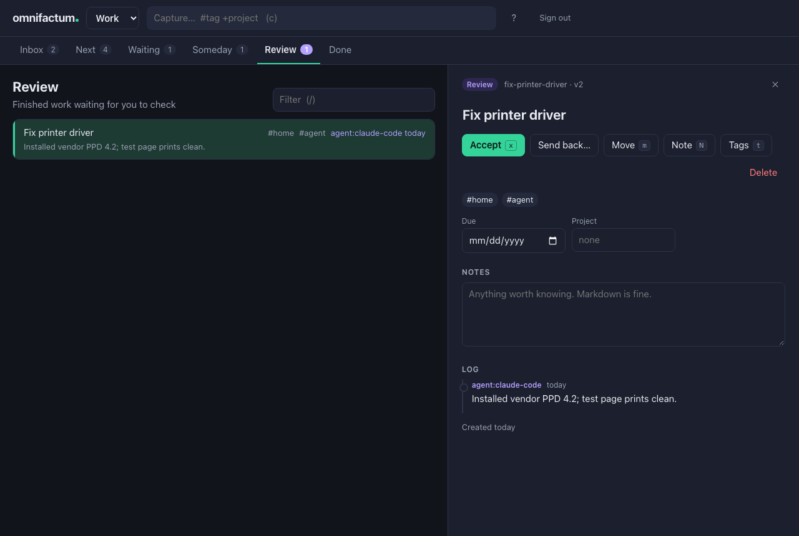

<picture>
  <source media="(prefers-color-scheme: dark)" srcset="assets/wordmark-dark.svg">
  
</picture>

A Getting Things Done task manager that runs on your own network. One small server holds
your lists; you work them from a browser on any device in the house, and AI agents work
them through a JSON command line or HTTP API — all at the same time, without anyone
overwriting anyone else.

Each account is its own set of lists, so **work** and **home** never mix.



**Contents**

- [Install and run](#install-and-run) · [Your first five minutes](#your-first-five-minutes)
- [The six lists](#the-six-lists) · [The web app](#the-web-app) · [The command line](#the-command-line)
- [Projects](#projects) · [The weekly review](#the-weekly-review)
- [Working with AI agents](#working-with-ai-agents) · [Your data](#your-data)
- [Questions](#questions) · [Development](#development)

## Install and run

You need [Bun](https://bun.sh).

```bash
brew install bun
bun install
bun link                 # puts `omni` on your PATH
omni serve               # starts the server
```

`omni serve` prints the addresses it is listening on:

```
omni is serving /Users/you/.omnifactum/omni.db
  on this machine:  http://localhost:7777
  on your network:  http://192.168.1.20:7777
```

Open either in a browser, pick **work** or **home**, and you are in. It listens on every
interface by default so your phone and other computers can reach it; use
`--host 127.0.0.1` to keep it to this machine, and `--port` to move it.

### Keep it running

On a Mac, make it a background service that starts when you log in and restarts itself if
it ever stops:

```bash
bun run service:install    # or: omni service install [--port 8000]
```

Then, from the repo:

| Command | Does |
| --- | --- |
| `bun run status` | whether it is running |
| `bun run restart` | restart it — do this after changing the code |
| `bun run stop` | stop it until you next log in |
| `bun run start` | start it again |
| `bun run logs` | follow the server log |
| `bun run service:uninstall` | stop it and remove the service |

Each is `omni service <command>` underneath, so they work from anywhere too. The first
time another device connects, macOS may ask whether `bun` can accept incoming
connections; allow it, or only this Mac can reach the server.

<details>
<summary><code>omni: command not found</code></summary>

`bun link` installs into `~/.bun/bin`, which is **not** added to your PATH if you
installed Bun through Homebrew — only Bun's own install script adds it. Add it once:

```bash
echo 'export PATH="$PATH:$HOME/.bun/bin"' >> ~/.zprofile
exec zsh -l
```

</details>

<details>
<summary>A standalone binary, with no Bun needed to run it</summary>

```bash
bun run build     # produces dist/omni, web app included
```

Copy `dist/omni` anywhere on your PATH.

</details>

### Accounts, PINs and tokens

There are two accounts to start with, `work` and `home`. `omni account add <name>` makes
more.

Anyone on your network can open an account from the browser. This is meant for a home
network, not the internet. To keep casual visitors out of an account, give it a PIN. It
won't stop someone determined: guesses aren't limited, it isn't encrypted on the way to the
server, and the command line doesn't ask for it.

```bash
omni account pin work 4821     # the browser now asks for it
omni account pin work          # and now it does not
```

The command line needs a **token**, which says which account it works in and who it is.
Give this machine one:

```bash
omni account token work you --save
```

`--save` makes it this machine's default. On another computer, or for a second account,
set it in the environment instead:

```bash
export OMNI_URL=http://192.168.1.20:7777
export OMNI_TOKEN=omni_...      # from: omni account token home you
```

`omni account list` shows the accounts and every token; `omni account revoke <token>`
stops one working.

### Bringing in your old vault

If you used omnifactum when tasks were markdown files, import them:

```bash
omni import ~/.omnifactum --account home
```

Ids, logs, stems, projects and the weekly review log all come across, so an agent holding
an old task id still finds the same task. The files are read, never changed, and running
it twice skips what is already there.

## Your first five minutes

**Write something down.** In the web app, type into the capture box at the top — `#tags`
and a `+project` are pulled out of the line — or from a terminal:

```bash
omni add "That thing Priya mentioned"
omni add "Fix printer driver" -t home --next
omni add "Order tiles" -t home --next
```

The first lands in your **inbox**, for things captured but not yet decided about. The
other two went straight to **next**, the list of things you could actually do now.

**See what you could be doing.** Press `2` in the web app, or:

```bash
omni next
```

**Decide what the inbox item really is**, then move it with `m` — to `next` if there is
something to do, `someday` if not now, or delete it if nothing needs doing.

**Finish something.** Select it and press `x`, or:

```bash
omni done fix-printer-driver --note "Vendor PPD 4.2 did it."
```

Completed tasks move to `done`, out of your way but not gone. The note goes into the
task's log, a permanent record of what happened to it.

That is the whole loop: capture without thinking, clarify deliberately, work from `next`,
and look over everything once a week.

## The six lists

| List | What belongs in it |
| --- | --- |
| `inbox` | Captured, not yet thought about. Empty this regularly. |
| `next` | Ready to act on now. If it is here, you can start it. |
| `waiting` | Delegated to someone, or blocked on something outside you. |
| `someday` | Not now. Reconsidered at your weekly review. |
| `review` | An agent finished it and you have not checked it yet. |
| `done` | Completed. |

`review` is not part of GTD — it exists because an agent finishing a task does not get to
decide the task is finished. See [Working with AI agents](#working-with-ai-agents).

A task in `someday` can carry a `defer` date. When that date arrives the server moves it to
`next` for you, within a minute. That is why `next` can be read literally: if something
is in there, it is actionable today.

## The web app

It is built for the keyboard and works fine without one. Press `?` for the full list —
it is generated from the keymap itself, so it can never be out of date.

| Key | Does |
| --- | --- |
| `j` / `k` | next / previous task |
| `g` / `G` | first / last task |
| `enter` | open the task |
| `esc` | close it, or clear the filter |
| `1`–`6` | inbox, next, waiting, someday, review, done |
| `/` | filter, with the [same queries](#finding-things) as the command line |
| `c` | capture into the inbox |
| `x` | complete (accept, in review) |
| `m` | move to another list |
| `t` | edit tags |
| `N` | record what happened |
| `X` | delete permanently, after asking |

The review tab shows each submission's note on the row itself, so you can read what an
agent did without opening anything. **Accept** completes it; **Send back** returns it to
`next` and asks why, so whoever picks it up next knows what was wrong.

On a phone the lists and the task open full-screen, and the capture box sits at the top.

### It notices changes made elsewhere

When an agent submits work or someone completes a task on another device, every open
browser updates at once and says what happened and who did it:

```
"Tidy the shared drive" moved to review by agent:claude-code: Archived 212 stale files
```

### Edits never silently overwrite each other

Actions — complete, move, tag, note — are sent as intentions and applied to the task as it
is at that moment, so they never undo anything done in the meantime.

Editing a field replaces it, so the edit carries the version of the task you started from.
If the task changed in between, the app checks whether it was *your* field that changed.
Usually it was not — an agent added a log line — and your edit goes through untouched. If
someone else really did rewrite the same notes or title, you are shown both and asked
which to keep.

## The command line

Everything the web app does is available as a command, and every command takes `--json`.
Commands run on the server, against the account your token belongs to.

| Command | Does |
| --- | --- |
| `omni add "Title"` | capture a task |
| `omni list [query]` | tasks matching a query; defaults to `next` |
| `omni inbox` / `next` / `waiting` / `someday` / `review` | one list |
| `omni due` | everything with a deadline, soonest first |
| `omni show <task>` | one task in full, including its log |
| `omni done <task>` | complete it |
| `omni mv <task> <list>` | move it |
| `omni note <task> "..."` | add a line to its log, changing nothing else |
| `omni tag <task> +add -remove` | change its tags |
| `omni tags` | every tag in use, with counts |
| `omni rm <task> --yes` | delete it permanently |
| `omni project …` | [projects](#projects) |
| `omni weekly` | [the weekly review](#the-weekly-review) |
| `omni submit <task> --note "..."` | hand finished work back for review |
| `omni agents` | print the contract agents read |
| `omni serve` | run the server and the web app |
| `omni account …` | accounts, PINs and tokens |
| `omni import <dir> --account <name>` | bring in a markdown vault |

`omni help` lists them all. A few aliases are not in that list but work anyway: `ls`,
`a`, `new`, `complete`, `move`, `delete`, `remove`, `cat`, `projects` and `p`.

**Referring to a task** means its id, any unambiguous prefix of that id, or its stem (the
slug of its title shown by `omni show`) — not its title. `omni rm buy-milk` works; `omni rm "Buy milk"` does not.

**Useful flags on `add`**: `-t tag`, `-p project`, `--due 2026-09-14`, `-n "a first
note"`, and `--next` / `--waiting` / `--someday` to skip the inbox. Add `-w "Sam"`
alongside `--waiting` to record who you asked, and `--defer 2026-10-01` alongside
`--someday` to park something until that date.

### Finding things

The same query language works on the command line and in the web app's filter box.

```bash
omni next home                 # tagged home
omni next calls home           # both tags
omni next home,work            # either tag
omni next --not home           # not tagged home
omni next /printer             # text in the title or body
omni list is:overdue           # everything past its deadline
omni list due:+7d              # due within a week
omni list project:renovate-the-kitchen
omni list state:waiting waiting_on:sam
omni list state:inbox no:tags  # captured and never tagged
```

Spaces mean **and**, commas mean **or**, and a leading `-` or `!` means **not**. There are
no parentheses, on purpose: one level of and-of-ors covers what people actually type at a
prompt.

One wrinkle: your shell reads a bare `-home` as a flag, so on the command line exclude a
tag with `--not home`, or quote it as `'!home'`. `-t` and `--any` exist for the same
reason. In the web app's filter box there is no shell in the way, and `-home` works
exactly as written.

| Field | Values |
| --- | --- |
| `state:` | `inbox` `next` `waiting` `someday` `review` `done` |
| `project:` | a project's stem |
| `waiting_on:` | who you are waiting on (substring match) |
| `due:` | `today` `tomorrow` `+7d` `-2w` `+1m` `2026-09-14`, optionally prefixed `<=` `>=` `=` |
| `is:` | `overdue` `deferred` `done` `tagged` `untagged` |
| `has:` / `no:` | `project` `due` `defer` `tags` `waiting_on` `body` `log` |

## Projects

A project is any outcome that takes more than one action. It has an `outcome`: a sentence saying what "done" will look like.

```bash
omni project new "Renovate the kitchen" --outcome "Cooking in the new kitchen"
omni add "Order tiles" -p renovate-the-kitchen --next
omni project list
```

```
renovate-the-kitchen  Renovate the kitchen  (1 live)
```

A project with nothing in `next` or `waiting` to move it forward is **stalled**, and both
`omni project list` and the weekly review call that out. It is the most common way a
project quietly dies, and the outcome statement is what makes it noticeable — without one
there is no way to tell a finished project from an abandoned one.

| Subcommand | Does |
| --- | --- |
| `omni project list` | every project, with `STALLED` and counts |
| `omni project new "Title" --outcome "..."` | start one |
| `omni project show <project>` | the project, plus its actions |
| `omni project outcome <project> "..."` | change what done looks like |
| `omni project rename <project> "New title"` | rename it *and* repoint its tasks |
| `omni project done <project>` | finish it |
| `omni project mv <project> <active\|someday\|done>` | park it or revive it |

`omni project rename` repoints every member task in one pass, and keeps the old name as an
alias so anything still using it resolves. `omni project done` refuses while actions are still open, unless you
pass `--yes`.

Projects are command-line only for now; the web app shows a task's project but has no
project view yet.

## The weekly review

The habit that stops the whole system quietly rotting. It walks every list and asks a
different question of each.

```bash
omni weekly              # what each list wants you to look at
omni weekly --record     # log the pass and stamp the projects
```

```
1. Empty the inbox  (1)
   For each: is it actionable? If so, what is the very next physical action?
   · 1 item still to be thought about

2. Check finished work  (0)   — clear
   Read what was done. Accept it, or send it back with a reason.

3. Review your next actions  (4)
   Is each of these still the right next step, and still worth doing?
   · "File the quarterly taxes" is past its due date
```

It flags things worth acting on rather than just counting them: an overdue action, a
delegation nobody has chased in a week, a project with no next action or no outcome, a
task pointing at a project that no longer exists. A step with nothing to do says `clear`
so you can move straight past it.

The web app does not walk the review yet; run it from the command line and fix things in
whichever you prefer.

Recording appends a line to the account's review log and stamps every active project with the date,
which is what makes "what have I not looked at in a month" answerable later.

## Working with AI agents

`omni` has no AI features of its own. It is the filing cabinet; an agent is just another
actor that can open the drawer.

**Give each agent its own token**, so the log says which one did what and it cannot pass
itself off as you:

```bash
omni account token work agent:claude-code
```

Hand it that token as `OMNI_TOKEN` (and `OMNI_URL` if it runs elsewhere), and point it at
the guide:

```
Run `omni agents` and work the tasks tagged `agent`.
```

`omni agents` prints the contract — it is also served at `/api/agents` — covering how to
find work, how to report what was done, how to refer to a task, the exit codes, the HTTP
API, and what not to touch.

For Claude Code specifically there is a ready-made skill in this repo at
`skills/omni-work/`, which walks the whole loop — find, read, do, submit — and
knows the things that otherwise cost an agent a few wasted minutes. Copy it to
`~/.claude/skills/` to have it available from any project:

```bash
cp -r skills/omni-work ~/.claude/skills/
```

Then `/omni-work`, or just ask for the task queue to be worked.

**Mark work as fair game** by tagging it `agent`. Agents are told to take work only from
`next` — never from `inbox` (not thought about yet), `someday` (deliberately not now),
`waiting` (someone else owns it) or `review` (already finished).

```bash
omni next --tag agent --json
```

**Agents do not mark tasks done.** They submit:

```bash
omni submit 1nab5 --note "Installed vendor PPD 4.2." --json
```

That moves the task to `review` — a queue you drain, the way `inbox` is a queue for things
you have not thought about yet. `omni done` is refused outright for an agent's token,
with `--force` as an explicit override. The token decides who the agent is, so setting
`OMNI_ACTOR=you` does not get around it.

**You decide:**

```bash
omni review                                   # what is waiting for you
omni done fix-printer --note "Checked, fine." # accept it
omni mv fix-printer next --note "Still jams." # send it back, with a reason
```

`--note` is required when submitting, because a submission with nothing to read gives you
nothing to review. Sending work back carries a note too, so the agent finds out what was
wrong rather than guessing. In the web app, sending work back asks for the reason first.

For progress that is not a state change, `omni note <task> "..."` adds a line to the log
and leaves everything else alone.

### The JSON contract

Every command takes `--json`. Successes and failures both arrive as JSON on **stdout**,
with stderr empty, so one parse covers every outcome:

```console
$ omni show nope --json
{
  "ok": false,
  "error": "no task matches \"nope\"",
  "code": 3
}
```

| Exit code | Means |
| --- | --- |
| 0 | it worked |
| 1 | it failed |
| 2 | the command was wrong, or the token was missing or refused |
| 3 | no such task, or the reference was ambiguous |
| 4 | the server was unreachable or busy; wait a moment and retry |

Anything that can speak HTTP can skip the CLI: `GET /api/tasks?state=next&q=agent`,
`POST /api/tasks/<task>/submit`, and so on, with `Authorization: Bearer <token>`. The
full table is in `omni agents`.

### You and agents at the same time

This is safe, and it is tested by a dozen real processes hammering one task at once.

There is one writer — the server — and every change runs in a single database transaction
that **reads the task and changes it together**, so a change applies to whatever the task
has become rather than to a copy read a moment earlier. Two agents adding a tag both get
their tag. An agent completing a task you are looking at does not undo the tag you just
added. Completing something already finished fails cleanly instead of happening twice.

**Give a command your change, not a finished result.** `omni tag 1nab5 +reviewed` adds to
whatever tags exist at that moment. Reading a task, editing the tag list yourself, and
writing the whole thing back would discard anything added in between. Over HTTP, a `PATCH`
that replaces a field carries the task's `version` as `If-Match`, and is refused with the
current task if someone got there first.

## Your data

Everything lives in one SQLite file, `~/.omnifactum/omni.db` (override the folder with
`OMNI_DIR` or `--dir`). Each account's tasks, projects and logs are kept apart inside it.

**Back it up** with SQLite's own backup, which is safe while the server runs:

```bash
sqlite3 ~/.omnifactum/omni.db ".backup ~/omni-backup.db"
```

**Tags are whatever you type.** There is no registry to add them to. Contexts, energy
levels and priorities are all just tags, which is why there are no separate fields for
them. `omni tags` lists every one in use.

### Environment

| Variable | Does |
| --- | --- |
| `OMNI_DIR` | where the database lives (default `~/.omnifactum`) |
| `OMNI_URL` | the server the CLI talks to (default `http://127.0.0.1:7777`) |
| `OMNI_TOKEN` | the CLI's token (default: the one saved with `--save`) |
| `OMNI_ACTOR` | who the log records, for a person's token; an agent's token ignores it |
| `OMNI_HOST` / `OMNI_PORT` | defaults for `omni serve` |

## Questions

**Is there an undo?** No. No trash and no version history. `omni rm` asks for `--yes` and
suggests `omni mv <task> someday` instead, and the web app confirms before deleting.
Back up the database if that worries you.

**Is it secure?** It is built for a home network. Anyone who can reach the server can open
an account without a PIN, and the traffic is plain HTTP. Do not expose it to the internet.

**Why can't agents mark things done?** Because completed work drops out of every default
view, and noticing it would then depend on remembering to go and look. Remembering is
exactly the thing worth removing. `review` is list `5`, and its count is highlighted on
the tab whether you go looking or not.

**Why is the weekly review called `weekly` and not `review`?** Because `omni review`
already lists the work agents have handed back.

**Does a task in `review` count as progress for its project?** Yes, so the stalled check
does not nag about work that is genuinely moving.

**Where did the terminal interface go?** The web app replaced it. The guided clarify
walk, the weekly review walk and the projects view have not been rebuilt in the browser
yet; `omni weekly` and `omni project` cover the latter two from the command line.

## Development

```bash
bun run test               # typecheck, then the full suite
bun run typecheck
omni serve --dev           # the web app with hot reloading
```

The boundary that matters: `src/core/` imports nothing from the filesystem, the database,
React, the clock, or randomness. Time and identity are passed in, which is what makes most
of the suite ordinary equality tests. The browser bundle imports the same core, so the web
app, the CLI and the server agree on dates, capture syntax and queries by construction.

- `src/db/` — the schema, and the store that carries planned changes to rows
- `src/server/` — `Bun.serve`: the JSON API, the event stream, the tickler timer
- `src/commands/` — every command, run on the server against the caller's account
- `src/web/` — the React app, bundled by Bun from `index.html`
- `src/cli.ts` — the client, plus `serve`, `account` and `import`

A test preload points `OMNI_DIR` at a temporary directory, so no test can reach your real
database.
